# Project 5

## Part 1

1. Download the ossicial docker image from nginx using `docker pull`
 
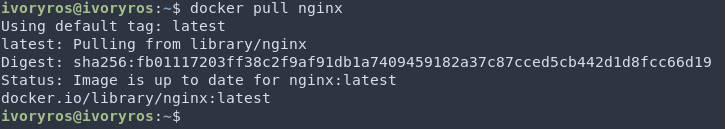

2. Check docker image with `docker images`
 
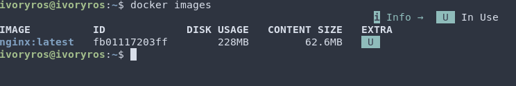

3. Run docker image wtih `docker run -d nginx`
 

4. Check that the image running with `docker ps`
  
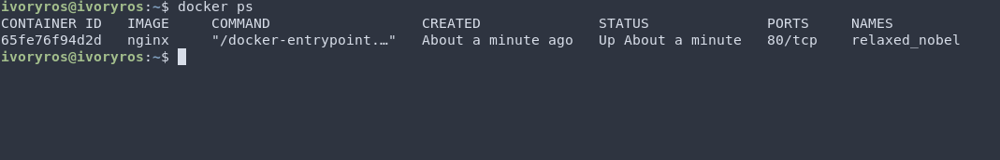

5. View container information with `docker inspect 65fe76f94d2d` and define the container size, list of mapped ports and container ip

| Name  |  Value     |
|-------|------------|
| Size  | 165265408  |
| Ports | none       |
| IP    | 172.17.0.2 |

6. Stop docker container with `docker stop`
 
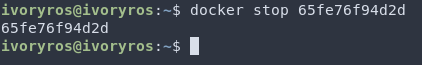

7. Check that the container has stoppesd with `docker ps`
 
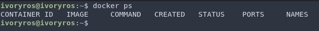

8. Run docker with ports 80 and 443 in container, mapped to the same ports on the local machine
 

9. Check that the nginx start page is available in the browsew at _localhost:80_
 
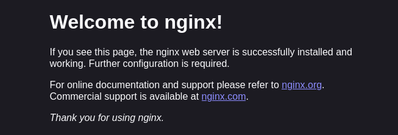

10. Restart docker with `docker restart`
 
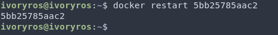

11. Check that the container has started
 
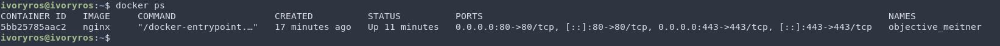

## Part 2

1. Reading the _nginx.conf_ configuration file inside the docker container with `exec` command
 
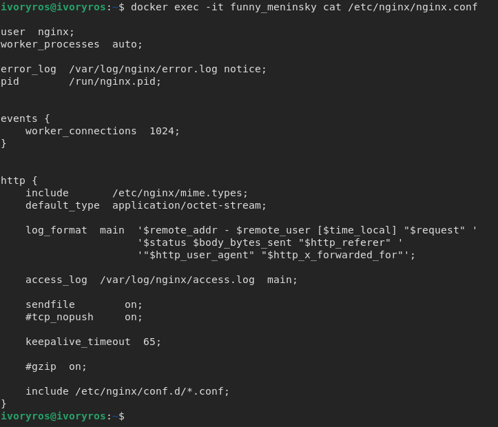
 
2. Creating a _nginx.conf_ file on the local machine and configuring it on the _/status_ path to return the nginx server status page
 
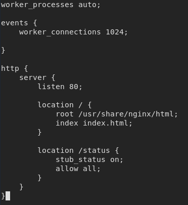

3. Coping the created _nginx.conf_ inside the docker image using `docker cp` command
 
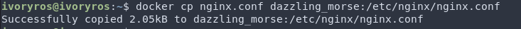

4.  Restarting _nginx_ inside the docker image with `exec`
 
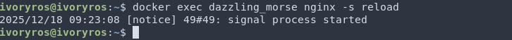

5. Checking that _localhost:80/status_ the nginx server status page
 
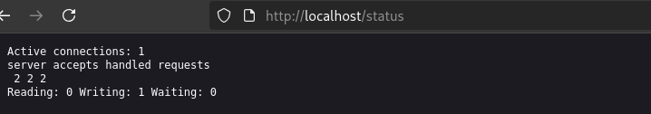

6. Exporting the container to a _container.tar_ with the `docker export` command
 
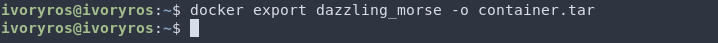

7. Stopping the container
 
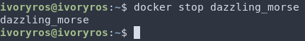

8. Deleting the image with `docker rmi` without removing the container
 
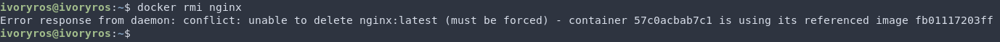

9. Deleting stoped container
 
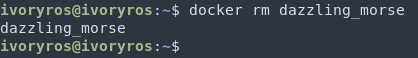

10. Importing the container back using the `import` command
 
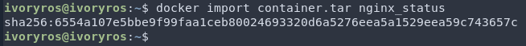

11. Runing the imported container
 
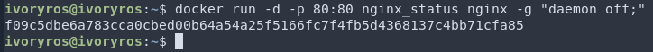

12. Checking that _localhost:80/status_ returns the nginx server status page
 
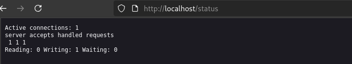